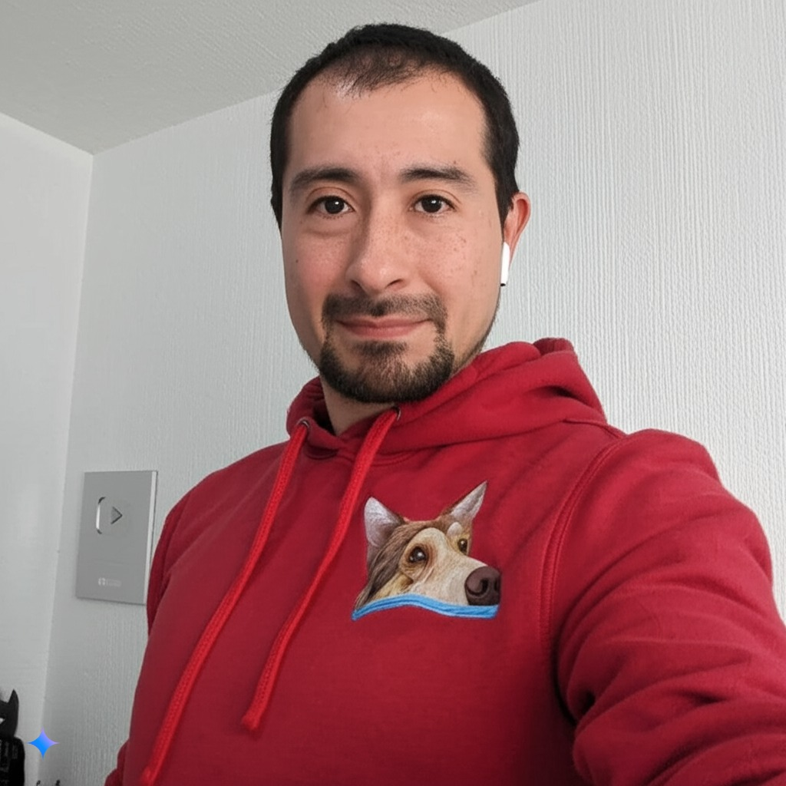

# Integrantes del grupo _3DEV_ de la asignatura Programación en Lenguajes Interpretados

## Profesor

### Jonathan MirCha

Hola soy tu amigo y docente digital... Jonathan Mircha

- [jmiranda@amerike.edu.mx](jmiranda@amerike.edu.mx)
- [_@jonmircha_](https://github.com/jonmircha)
  

---

## Estudiantes
### Alejandro Limon Perez
 Soy una persona muy tranquila y que esta estudiando para hacer videojuegos
 - [cdmx2960@amerike.edu.mx](tucorreo@amerike.edu.mx)
 - [Mi perfil de _GitHub_](https://github.com/Angry6irds)
 
